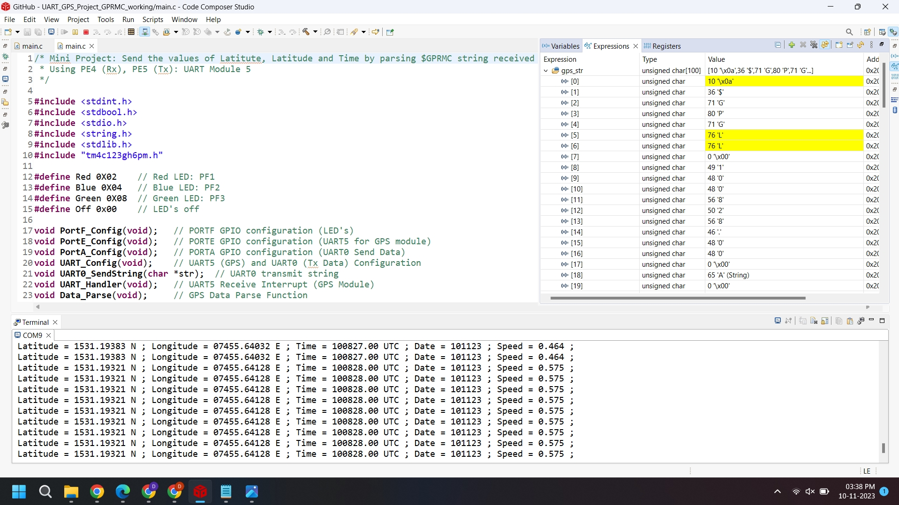

# Mini Project: GPS Interface - Read serial data from a GPS module and print the current date/time OR speed OR position using TM4C123GH6PM microcontroller.

Group 10: EE23DP003 Daniel Dsa; 222021006 Pradeep Kumar M

## Aim:
* To implement UART based communication on the TM4C123GH6PM microcontroller to continuously recieve serial data from a Ublox Neo-6M GPS module. 
* To parse the NMEA string ($GPGLL and $GPRMC) and transmit the value of date, time, latitude and longitude through UART0 that can be viewed in the serial terminal window in CCS.

## Program flow:
* Configure the TM4C123GH6PM to enable UART communication at 9600 baud rate with odd parity on UART0 and UART5. Enable UART5 receive interrupt.
* Go to the appropriate 'state' in the UART5 handler when the UART5 interrupt is received.
* The states in the UART handler are defined as follows: state 0 = wait for $; state 1 = check for GPGLL; state 2 = Read till '\r'.
* In main program, continuously call the 'Data_Parse()' and 'Data_Send()' functions.
* 'Data_Parse()' function seperates the GPS data into tokens based on the ',' seperator. 
* 'Data_Send()' function sends the GPS data (date, time, latitude, longitude) over UART0 that can be viewed in the serial terminal window. 

## Flowchart:

*Flowchart for reception, parsing the and transmitting GPS data back on UART*

## Description of the Neo-6M GPS module:

* The GPS module is from U-blox – NEO-6M. It can track up to 22 satellites over 50 channels and achieve tracking sensitivity of -161 dB, while consuming 45 mA current.

*The required data pins of the NEO-6M GPS chip are broken out to a 0.1″ pitch headers. It contains the pins needed for communication with the microcontroller over UART. The module supports baud rates from 4800bps to 230400bps with a default baud of 9600.

*NEO-6M GPS module and antenna*

## Parsing NMEA (National Marine Electronics Association) GPS Sentences:

Parsing is extracting chunks of data from the NMEA sentence.

There are many sentences in the NMEA standard. The two types of GPS NMEA sentences parsed in this project are $GPGLL and $GPRMC:

$GPGLL provides time, latitude, longitude.
$GPRMC provides time, date, latitude, longitude, altitude, and estimated velocity.

*Geographic Position Latitude / Longitude (GPGLL) NMEA Sentence Table*

*Recommended Minimum Specific GNSS Data (GPRMC) NMEA Sentence Table*

## Results:
* The pins PE4 (U5Rx) on the TM4C123GH6PM microcontroller is connected to the Tx pin of the NEO-6M GPS module. The parsed data is transmitted over UART0 pin PA1(Tx) and can be viewed in the serial termnial window in Code Composer Studio.

*Display of Latitude, Longitude and Time in Serial Terminal window after parsing $GPGLL string*

*Display of Latitude, Longitude, Time. Date and Sppeed in Serial Terminal window after parsing $GPRMC string*

* The latitude and longitude data seen in the terminal window for the GPRMC or GPGLL data can be viewed in Google maps by converting the ddmm.mmmm format for latitude and dddmm.mmmm format for longitude into dd.dddd format

* To convert into dd.dddd format, the following conversion is done:
* dd + mm.mmmm/60 for latitude
* ddd + mm.mmmm/60 for longitude

*The obtained data as seen in the terminal window for the $GPRMC string in ddmm.mmmm format is Latitude = 1531.19383 N,  Longitude = 07455.64128 E

* Converting the latitude to dd.dddd format:   15 + 31.1938/60  = 15.5198 N
* Converting the longitude to dd.dddd format:  074 +55.6412/60 =  74.9273 E

* Entering the co-ordinates 15.5198 N 74.9273 E into google maps displays the address which closely matches with the actual location:

*GPS location as seen on Google Maps*

